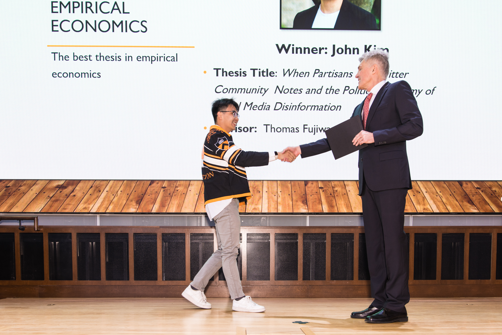

```{r setup, include=FALSE}
knitr::opts_chunk$set(echo = FALSE)
```

``` {r}

```

# Hello!
My name is John Kim, and I was born and raised in Los Angeles, California. My hobbies include traveling, 
watching eSports (#C9WIN), learning Japanese, and seeking out delicious new places to eat
throughout SoCal and the East Coast. I also love to sing, even though I'm not any good at it!
Feel free to ask me about my favorite restaurants and foodie moments!

# Technology
R, Java, Python, SQL

# Selected Coursework (Software in Parenthesis)

* ECO310 - Microeconomic Theory: A Mathematical Approach
* ECO302 - Econometrics (R, Stata)
* POL346 - Applied Quantitative Analysis (R)
* POL349 - Political Economy
* COS226 - Algorithms and Data Structures (Java)
* COS324 - Introduction to Machine Learning (Python)
* SOC306 - Machine Learning with Social Data (R)
* SPI586f - Technology Policy and Law

# Resume
A (usually not up-to-date) copy of my resume can be found [here](https://benidjones.github.io/images/Kim_John_Resume.pdf).