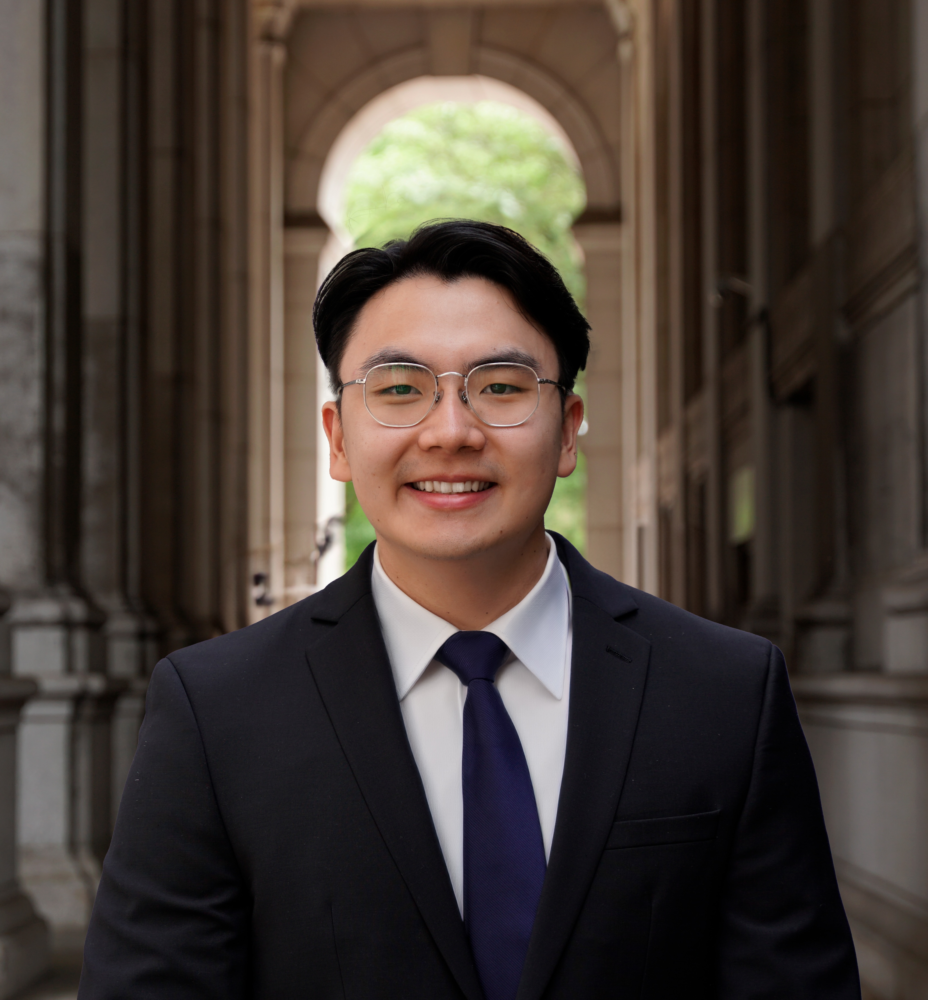

```{r setup, include=FALSE}
knitr::opts_chunk$set(echo = FALSE)
```

``` {r}

```

# At a Glance
I am a student at Princeton University studying political economy and technology. I am particularly interested in quantitative and computational social science, with applications to machine learning, causal inference, and technology policy. I've most recently researched political disinformation on Twitter and antitrust law/policy in self-preferencing. 

I most recently served as a Technical Engagement Management Intern at Yext. 

For more about me, as well as a copy of my resume, see my [bio](https://benidjones.github.io/about.html). 

# Academic

A.B. Economics, **Princeton University** '23

* Program in Political Economy, Departments of Politics & Economics
* Certificate in Applications of Computing, Department of Computer Science

# Awards, Recognition, and Fellowships

2022: Invited Panelist, [New America: PIT-UN](https://pitcases.org/annualconvening/)

* Invited panelist to speak at the Public Interest Tech University Network Convening 2022 at CUNY Graduate Center in New York. Spoke about undergraduate education and experiences in technology policy in a workshop entitled "PIT in Action: PIT Students Take the Lead". 

2021: Public Interest Technology Fellow, [Center for Information Technology Policy](https://citp.princeton.edu/) 

* Fully funded program to gain first-hand experience in technology policy. Includes a training bootcamp in technology policy, placement in a government agency working on public interest technology, and a stipend. 

2020: Osawa Fellow, [Princeton in Asia](https://piaweb.princeton.edu/) 

* Fully funded program to live and teach English in Tokyo, Japan on behalf of various schools and businesses, as well as a stipend for independent travel around Japan. Rescinded due to COVID-19. 

2019: QuestBridge Match Scholar, [QuestBridge](https://www.questbridge.org/) 

* Scholarship program for low-income, high-achieving high school students to attend top universities across the US. Provided admission and scholarship to attend Princeton University, valued at $200k+. 