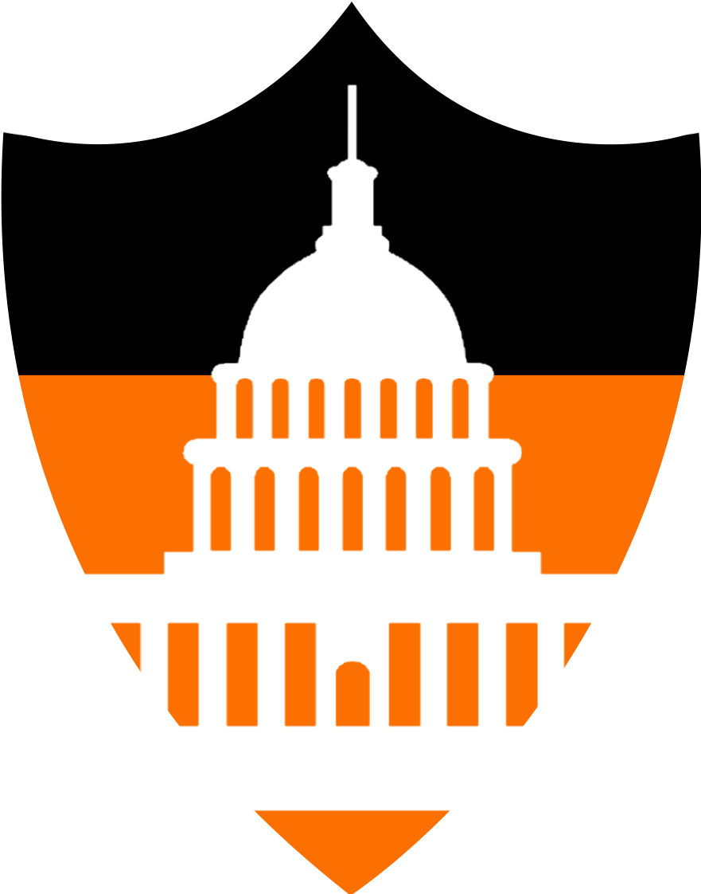

```{r setup, include=FALSE}
knitr::opts_chunk$set(echo = FALSE)
```

# [Princeton Model Congress](princetonmodelcongress.com)

{#id .class width=20% height=20%}

America's oldest model congress conference held in Washington DC. As one of PMC's Directors of 
Administration for two years, I am in charge of conference logistics running up to
and day-of the event. For 2020, I (along with my fellow DAs) were able to successfully
plan and execute Princeton Model Congress 2020 virtually using the Attendify platform.

# [Rehack](rehack.co)

{#id .class width=50% height=50%}

The first-ever reverse hackathon, emphasizing a beginner-friendly approach where
competitors redesign and implement existing tech in a more meaningful, socially responsible way.
For Rehack's virtual hackathons in 2020 and 2021, I led marketing to bring West Coast
universities to Rehack for the first time. As a result, 9 West Coast Universities
fielded at least one team to compete at Rehack for the first time.


